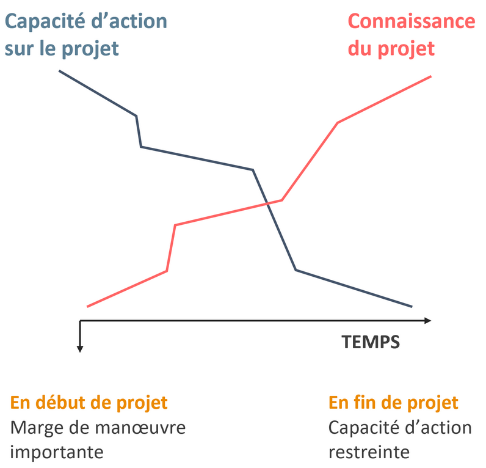
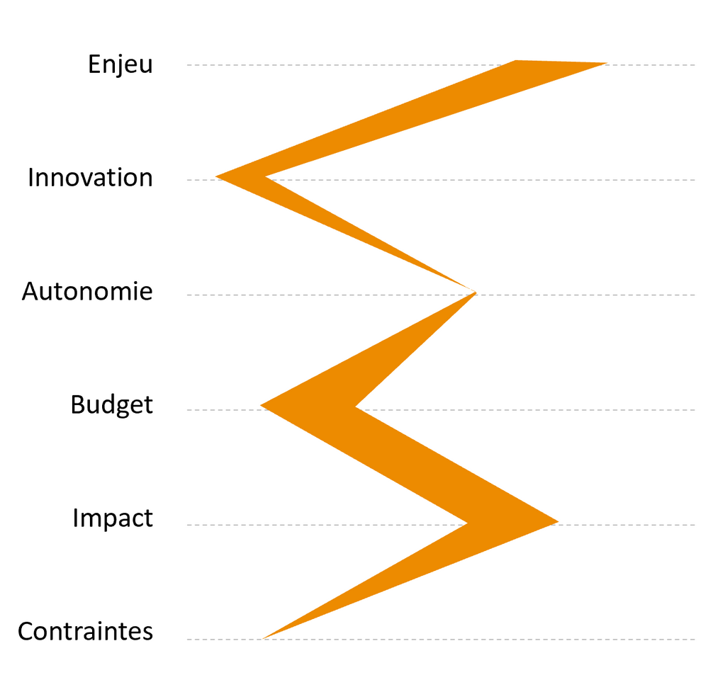
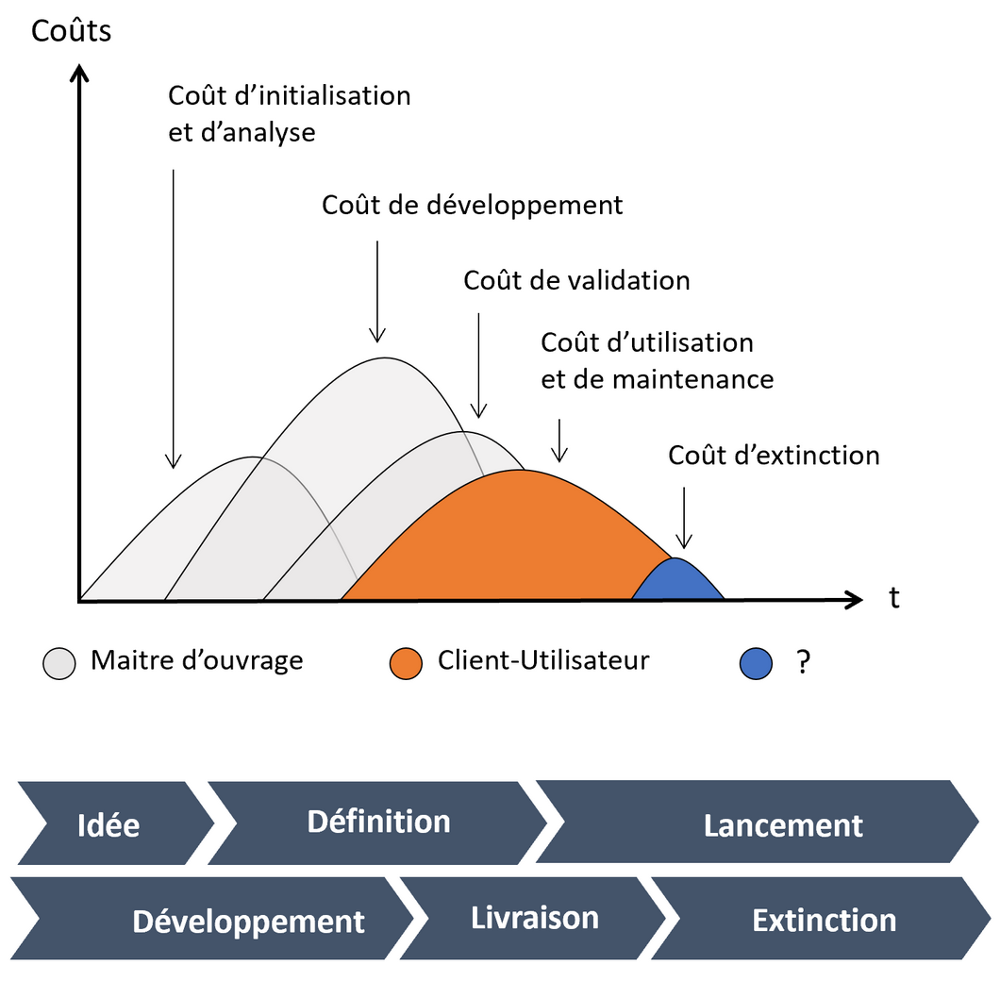

# Fondamentaux de la gestion de projet

> Adapté de "Fondamentaux de la gestion de projet" - MOOC GdP | Contenu sous licence CC BY-SA-NC 4.0

## Qu'est ce qu'un projet ?

> Action temporaire entreprise dans le but de créer un produit, un service ou un résultat unique.

Caractérisé par ces aspects :

1. Temporaire : un début et une fin
	- Qualité - coûts - délais
2. Par étape, se prépare
	- Anticiper : lots de travail, jalons
3. Résultat nouveau $=$ livrable

Evolution de la paire connaissance du projet / capacité d'action sur le projet (**Paradoxe de la gestion de projet**)

## Les organigrammes projets

| Structure                                             | Description                                                                                                  | Avantages               | inconvénients                                                              |
| ----------------------------------------------------- | ------------------------------------------------------------------------------------------------------------ | ----------------------- | -------------------------------------------------------------------------- |
| Fonctionnelle                                         | Pas de chef de projet : les départements se coordonnent directement                                          | Peu couteux             | Pas de responsable clair, n'avance pas                                     |
| Coordination de projet (structure matricielle faible) | Présence d'un coordinateur qui a pour but d'harmoniser les différents métiers mais sans pouvoir hiérarchique | Optimisation des moyens | Petits projets, manque d'autorité du coordinateur                          |
| Matricielle fort                                      | Chef de projet a un poids plus important, le même que les directions métiers                                 | Très adaptable          | 2 chefs = 2 conflits                                                       |
| Sorti                                                 | Acteurs détachés de leurs fonctions habituelles travaillant sur à plein sur le projet                        | A 100% sur le projet    | Réaffectation de l'équipe à la fin ? Perte de compétences collectives ? |

## Les profils de projet

Tracé des caractéristiques d'un projet sur une échelle faible / peu important à fort / important

## Dualité projet-opération

| Caractéristique | Projet                                             | Opération            |
| --------------- | -------------------------------------------------- | -------------------- |
| Coordination    | Chef de projet                                     | Manager Opérationnel |
| Objectif        | Prendre fin avec le projet                         | Routinier            |
| Equipe          | Temporaire                                         | Organisation pérenne |
| Compétence      | Très variées                                       | Spécialisées         |
| Tâche           | Jamais faite                                       | Répétable            |
| Planification   | Gestion du temps, coût et contraintes de périmètre | Sur un cycle annuel  |
| Budget et temps | A évaluer                                          | Fixes                |

## Coûts

## MOA - MOE - Comité de pilotage

- Maître d'ouvrage (MOA)
 	- Gestion des
  		- besoins
  		- objectifs
  		- budgets
 	- Représente
  		- Porteur de budget
  		- Utilisateurs
  		- Direction
- Maître d'oeuvre
 	- Réalise, exécute et sous-traite
 	- Représente / gère
  		- Chef de projet
  		- Experts
  		- Equipe projet
  		- Sous-traitants
  		- Fournisseurs

## Gouvernance des projets

- Comité de pilotage
 	- Supervise le projet :
  		- décider des orientations / méthodes
  		- Définir le chef de projet, les moyens, les allouer
  		- Définir les grandes étapes
  		- Assurer le suivi
 	- Composé de :
  		- Décideurs (orientations stratégiques)
  		- Représentant maîtrise d'ouvrage
  		- Représentation directions métiers
 	- Role :
  		- Interlocuteur maître d'oeuvre
  		- Vérifie échéance / livrables
  		- Décider de la suite
 	- Si une seule personne : *sponsor*
- Cas de plusieurs projets :
 	- gestion des ressources / degré d'avancements
 	- répartition des risques
 	- exploitation de synergies entre les projets
