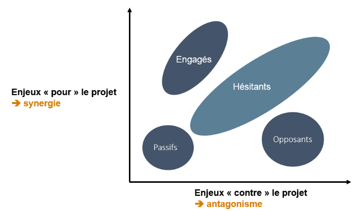
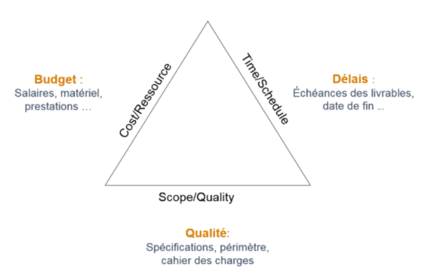
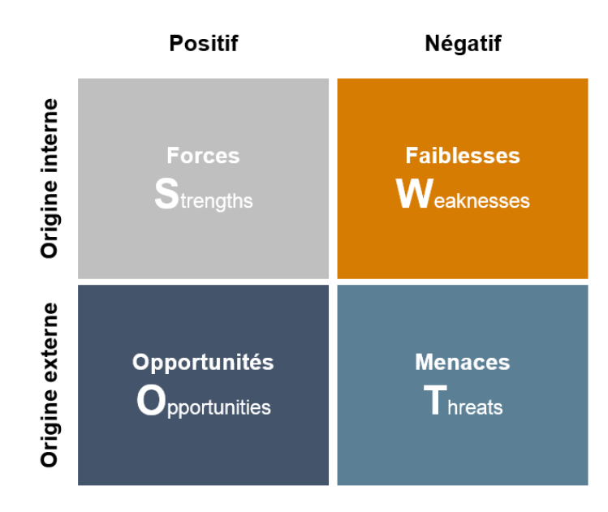
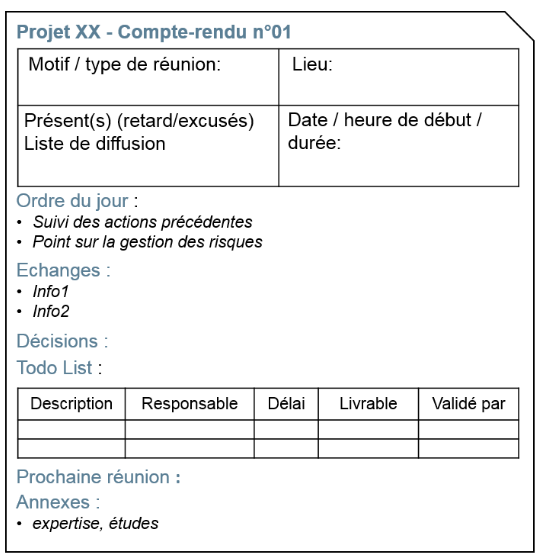

# L'essentiel pour démarrer un projet

> Adapté de "L'essentiel pour démarrer un projet" - MOOC GdP  

## Les parties prenantes du projet

### Les parties prenantes

| Nom                                                      | Fonction                                                      |
| -------------------------------------------------------- | ------------------------------------------------------------- |
| Clients, commanditaires, bailleurs de fonds.             | Demandent, financent le projet, propriétaires du livrable     |
| Chefs de projets, directeurs, coordinateurs de projet... | Pilotent le projet et assurent la coordination avec le client |
| Équipes projet, sous-traitants                           | Réalisent le projet                                           |
| Clients finaux, communauté                               | Sont également concernés                                      |

On peut représenter classer les parties prenantes selon 2 axes : ce qu’ils ont à gagner et ce qu’ils ont à perdre dans ce projet :

### Outil de négociation entre les parties : triangle QCD

Le triangle Qualité-Coût-Délai est un outil qui illustre les interdépendances entre la qualité, le coût et le délai d'une projet.  Sa version anglaise est : *Scope* pour Qualité, *Time* pour
Délais et *Cost* pour les Coûts.

- Qualité : spécifications techniques, les fonctions, la fiabilité du livrable, la facilité d'utilisation. On parle aussi de *périmètre du projet*
- Time : les délais
- Cost : budget

## Pertinence d'un projet : matrice SWOT

## Etre efficace en équipe avec le PDCA

Le PDCA est une méthode qui permet de s'assurer du bon avancement d'un projet. PDCA veut dire:

- *Plan* : Planifier
- *Do* ; Développer
- *Check* : Contrôler
- *Act* : Ajuster

Le PDCA consiste en la répétition d'un cycle :

1. Planifier :
	1. Identification du problème à résoudre
   		- A l’aide du QQOQCCP, du brainstorming ou d’outils de priorisation comme le Pareto ;
	2. Comprendre les causes
   		- Diagramme d’Ishikawa ou la méthode des cinq pourquoi
	3. Recherche de solution, d'un plan d'action
2. Développer :
   	- Faire la tache
   	- Attention à :
   		- *l'effet tunnel* : il faut faire le point régulièrement
   		- Garder une vision de l'avancement global
3. Contrôler :
   	- Est ce que l'état est satisfaisant ? Va-t-on dans la bonne direction ?
4. Ajuster

## Animation et efficacité des réunions

#### Quatre type de réunion :

- **Technique** : 
	  - résoudre un problème précis
	  - seulement les personnes concernées
	  - durée >1 h possible (seule réunion pouvant dépasser une heure)
- **Chantier** : 
	  - présenter avancement global, 
	  - comité de pilotage et responsables, 
	  - durée ≤1 h
	  - Si rapport présenté $\rightarrow$ *soutenance*
- **Avancement** : 
	  - suivi interne,
	  - équipe projet uniquement, 
	  - aller à l'essentiel : dure jamais plus de 1 h.  
- **Stand-up** : 
	  - très bref, debout
	  - $\rightarrow$ réaliser un point rapide dans l'équipe 
	  - chacun répond à trois questions : fait, à faire, difficultés

#### Compte-rendu

#### Efficacité 

Trouver le bon moment pour organiser la réunion. Fixer une date ni trop tôt ni trop tard.

- Inviter les bons participants. Il faut ni en oublier ni convier des personnes qui n’ont rien à apporter.
- Préparer la réunion. En moyenne 1 heure de réunion demande 4 heures de préparation.

Dans le déroulé de la réunion, l’animateur doit :

- Avant de commencer, balayer les objectifs en présentant l’ordre du jour ;
- Faire un tour de table, pour demander si des points complémentaires sont à ajouter ;
- Rappeler les livrables et les décisions prises la fois précédente ;
-  Et n’oublions pas que la réunion doit déboucher sur des actions précises.

## Répartition des tâches

- **Objectifs SMART** :  
    - Spécifique : Simple, précis et clair
    - Mesurable : Valeur numérique
    - Accepté : Ne pas décider à la place des autres
    - Réaliste/ambitieux, 
    - Temporel : borné dans le temps

- **Todo List** : centralise répartition et suivi.  
    - Version complète : tâche, responsable, échéance, charge, livrables, priorité, validation, avancement, retards.  
    - Version simplifiée : Pilote – Action – Délai.  

- **Mise en œuvre** :  
    - Élaboration collective (par ex. en réunion).  
    - Accessible à tous, mise à jour régulière.  

- **Conseils pratiques** :  
    - Clarifier les livrables.  
    - Prioriser les actions.  
    - Répartir de façon équilibrée (max. 3 tâches/personne/semaine).  
    - Simplifier régulièrement pour éviter surcharge et découragement.  
    - Détail des tâches essentielles avec PDCA.

## Jalonner un projet et éviter l’effet tunnel

- **Effet tunnel** : absence de visibilité entre le lancement et la livraison finale, conduisant à de mauvaises surprises.  
- **Solution : jalonnement** :  
    - Créer des jalons (objectifs intermédiaires mesurables).  
    - Livrables intermédiaires validés par les décideurs.  
    - Réunions de chantier comme points de passage.  
    - Objectifs fixés selon méthode SMART.  
    - Contrôle régulier via PDCA.  
- **Avantages du jalonnement** :  
    - Maintien de la motivation (objectifs courts).  
    - Implication continue du client (retours réguliers).  
    - Suivi de l’avancement et anticipation des retards.  
- **Comportements à éviter** :  
    - Côté maîtrise d’œuvre : rétention d’information, manque de transparence, retard non communiqué.  
    - Côté maîtrise d’ouvrage : désintérêt, changement de priorités sans prévenir.  
    - Facteurs humains : paresse, optimisme excessif. 

