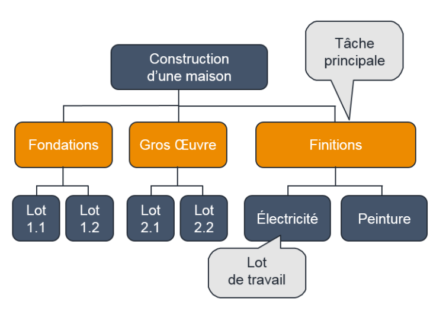
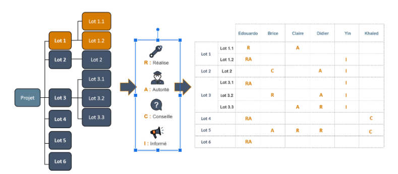
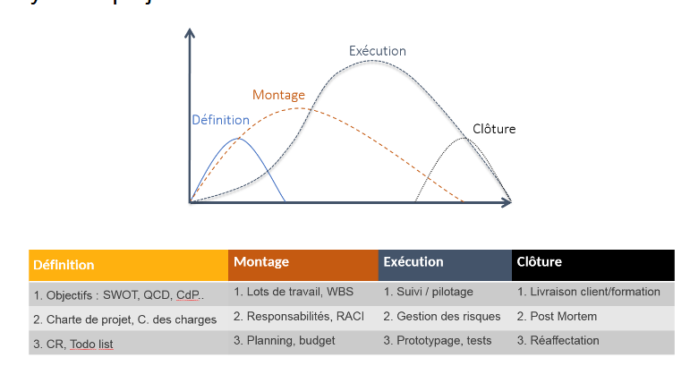
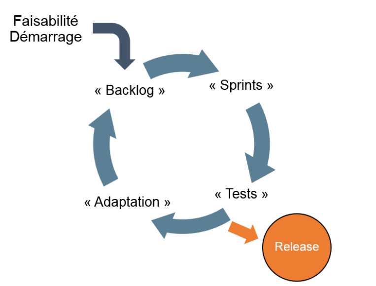

# Outils avancés de gestion de projet

> Adapté de "Outils avancés de gestion de projet" - MOOC GdP | Contenu sous licence CC BY-SA-NC 4.0

## Préparer un projet

Pour cadrer et préparer un projet on utilise une lettre de mission, un cahier des charges, une note de cadrage et une charte de projet.

### Charte de projet

**Pourquoi ?**

- Justifie la raison d'être du projet (Attendus et impact)
**Décrit**

- Livrables
- Budget
**Soutient la prise de décision**

- Quels rôles ?
- Est un outil de communication
**Officialise l'existence du projet**

- Rédigée par le futur chef de projet (ou par le commanditaire / un expert)
- Validée par les décideurs : maître d’ouvrage, hiérarchie, sponsor
**Anticipe le déroulement**

#### Quel contenu ?

- Résumé (Format *Executive summary*)

1. Cadrage
	- Contexte / Hypothèses de départ
	- Finalité et importance du projet
	- Objectifs et résultats opérationnels
3. Déroulement du projet
	- Organisation / ressource, budget
	- Jalons : échéanciers / événements important
	- Risques et opportunités

#### Cadrage & déroulement

- **Cadrage**
   	- présentation du contexte,
   	- explicitation des finalités du projet et examen de sa rentabilité pour justifier son existence: c’est le *Business case*.
        - raisons pour lesquelles le projet est lancé,
        - bénéfices attendus,
        - les coûts prévisibles,
        - les forces et faiblesses.
        - Sa synthèse est reprise sur une analyse SWOT.
   	- Reprise du cahier des charges : liste exhaustive des livrables $\rightarrow$ produits, services, documentation.

- **Déroulement**
   	- Définir les rôles et responsabilités, le pilotage du projet et son budget ;
   	- Le temps avec les principaux jalons ;
   	- Et enfin les risques et opportunités.

## Les lots et les responsabilités

Une fois le projet lancé un facteur de réussite critique est la division du projet en lots de travail ou *work packages*. On parle de découpage *WBS*, cette opération permet de :

- Réduire la complexité du projet pour le piloter
- Préparer son pilotage

Le WBS est définit comme la "décomposition hiérarchique \[...] du travail que l’équipe de projet doit exécuter pour atteindre les objectifs et produire les livrables”. Pour le construire il faut passer de la logique "que faire" à "comment le faire".

**Comment réaliser ce découpage ?**

Pour chaque tâche principale, on procède par analyse, autrement dit par décompositions successives. La somme des tâches principales constitue le projet.

Pour chaque tâche principale, on décompose selon un critère donné. Par exemple le métier qui réalise le travail, la localisation du chantier, l’ordre de succession.
Attention à utiliser une seule logique à la fois !

Chaque lot de travail doit être SMART.

**Exemple**

## La matrice RACI

La matrice RACI est un outil qui permet de distribuer les rôles et les lots de travail. Elle précise quatres types de responsabilités : celui qui réalise, celui qui a l’autorité, la personne qui est consultée et celle qui est informée. Pour la réaliser on part du WBS.

### Les rôles

- R :
   	- *Réalise, Responsible*
   	- membres opérationnels
   	- exécutent la tâche
- A :
   	- autorité, doit rendre des comptes
   	- *Accountable*
- C :
   	- *Consulted*
   	- Experts
- I :
   	- *informed*
   	- Doivent être tenus informés mais on n'attend pas leur retour

### Mise en place

- Un seul *A* par action : une seule personne à l'autorité finale.
- Au moins un *R*.
   	- Un seul acteur peut cumuler *A* et *R*
- Multiplier les *C* ralenti le projet, il faut donc consulter directement les experts les plus efficaces.
- Pour le *I* c’est plus simple : gardez tous les acteurs du projet régulièrement informés, sinon on vous reprochera de mal communiquer.
- Il faut préciser sur la matrice la signification des lettres !

## La planification : Diagramme de Gantt

**Étapes :**

1. **Séquencement** des work packages pour identifier les dépendances et périodes critiques.
2. **Diagramme de Gantt :**
    - Visualisation temporelle des tâches et jalons.
    - Identification du **chemin critique**.
    - Suivi de l’avancement et des retards.
3. **Charge de travail et budget :**
    - Charge exprimée en **jours-homme**.
    - Ressources : humaines, matérielles, financières.

## Le montage d'un projet

**Objectif :** gérer le **cycle de vie complet du projet**.

- **Les 4 phases :**
    1. **Définition** : objectifs, charte, cahier des charges.
    2. **Montage** : WBS, RACI, Gantt.
    3. **Exécution** : suivi, pilotage, prototypes.
    4. **Clôture** : livraison, post-mortem, réaffectation.
- **5 questions clés :**
    1. Que veut le client ?
    2. Qu’est-ce qu’il faut faire ? (WBS)
    3. Qui fait quoi ? (RACI)
    4. Quand le faire ? (Gantt)
    5. Avec quelles ressources ? (budget)  

**À retenir :** Le management du projet est un enchaînement logique et cohérent d’outils et de décisions.

## La planification

À partir du WBS il faut d’abord définir la succession des lots de travail et les dépendances. Le diagramme de Gantt sert à :

- définir un planning réaliste,
- suivre l’avancement et détecter les retards et leurs impacts,
- communiquer avec le client et les parties prenantes
- Identifier les périodes critiques.

### Construction

 Le Gantt doit etre construit après le WBS, il faut établir l’ordre de succession de chaque lot.

**Mettre en œuvre le Gantt.**

- Principe : temps horizontal, tâches verticales.
- Éléments graphiques : barres = lots de travail ; losanges = jalons.

- *Utilités du Gantt établi avant projet :*
   	- récapituler lots et durées ;
   	- planifier jalons et tâches ;
   	- indiquer liens entre tâches ;
   	- prendre en compte disponibilités et interruptions ;
   	- mettre en évidence le chemin critique qui détermine la date de fin.

- *Utilités en mode pilotage :*
   	- indiquer l’avancement de chaque lot ;
   	- comparer l’avancement à la date courante ;
   	- actualiser le suivi et recalculer le chemin critique.

- Avertissement : la mise à jour du Gantt est exigeante. Le chef de projet doit faire le point d’avancement de toutes les tâches.

### Charge de travail et budget

#### *Workload*

Pour chiffre les works package on utilise la notion de *Charge de travail* = temps-homme requis (*workload*).

- Distinction charge vs durée : ex. 4 jours-homme = 4j pour 1 personne, ou 2j pour 2 personnes, ou 8j si personne à mi-temps.

#### Budget

- Trois types de consommation chiffrées dans le budget :
    1. Ressources humaines (jours-homme).
    2. Investissements et amortissements (licences, locaux, machines).
    3. Entrées-sorties financières (trésorerie / cash).
- Rôles du budget : chiffrer les ressources et la faisabilité en phase d’amorçage ; contrôler l’avancement en cours de projet.

## Le montage global d’un projet

### Cycle de projet

1. **Définition**
    - Objectif : établir des objectifs et obtenir l’approbation pour démarrer.
    - Outils : SWOT, triangle Qualité-Coûts-Délais, carte des partenaires.
    - Documents : cahier des charges, charte projet.
    - Outils opérationnels de démarrage : compte-rendu, todo list.

2. **Montage**
    - Objectif : préparer le projet en détail.
    - Outils : découpage en lots (WBS), clarification des responsabilités (matrice RACI), diagramme de Gantt pour le calendrier.

3. **Exécution**
    - Objectif : réaliser le projet.
    - Activités : pilotage de l’avancement, suivi détaillé des risques, production de livrables intermédiaires (maquettes, prototypes, tests).

4. **Clôture**
    - Objectif : livrer et clore formellement.
    - Activités : mise en production, transfert au maître d’ouvrage, formation des utilisateurs, réunion de bilan (post-mortem), capitalisation du retour d’expérience, réaffectation des ressources.

Concevoir logiquement un projet : 5 questions à résoudre (ordre et correspondance outils).

1. Quel est le besoin client et quelles sont les contraintes ? → charte, cahier des charges.
2. Qu’est-ce qui doit être fait et comment découper en work packages ? → WBS.
3. Qui coordonne, réalise et valide chaque tâche ? → matrice RACI.
4. Quelle est la durée et l’ordre des tâches ? Comment estimer la charge ? → estimations, séquencement, Gantt.
5. Quel budget et quelles ressources sont nécessaires ? → chiffrage des ressources humaines, investissements, trésorerie

## Méthodes agiles

### Introduction

L’approche classique est séquentielle et documentée. Les méthodes agiles en proposent une alternative, critiquant l'approche classique :

- cahier des charges incomplet ou évolutif ;
- forte charge de coordination et de reporting ;
- détection tardive des risques ;
- documentation lourde pour planifier l’intégralité du projet.

### Méthodes agiles : fondamentaux

#### Principes communs

- cycles courts produisant versions successives ;
- implication continue du client pour validation et précision du besoin ;
- autonomie des équipes pour décider ;
- livrable incrémental (test puis amélioration) ;
- timeboxes suivies d’un bilan.

#### Cycles des méthodes agiles

- Début : estimer la faisabilité.
- Backlog : liste priorisée de tous les besoins.
- Sprints : séquences courtes pour satisfaire des éléments du backlog.
- Test après chaque sprint puis mise à jour du backlog.
- Le projet = suite de sprints, tests et adaptations conduisant à des releases.

#### Leçons principales

1. Ne pas réaliser le livrable une fois à la fin.
2. Chercher des résultats tangibles immédiatement.
3. Prioriser les fonctionnalités à forte valeur client.
4. Adapter le projet dès l’apparition d’un problème.

#### Limites et conditions d’application

- Domaines adaptés : projets de taille modeste, développement logiciel.
- Conditions nécessaires : disponibilité continue du client ; équipe formée et expérimentée ; forte autodiscipline ; capacité à travailler en autonomie ; bonne résistance au stress.
- Difficile à appliquer à grande échelle, notamment si le travail est largement sous-traité.
- Estimation du budget et des coûts difficile en mode agile en l’absence de phase de conception et de vision globale initiale.
