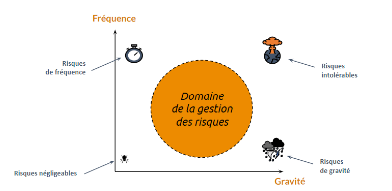
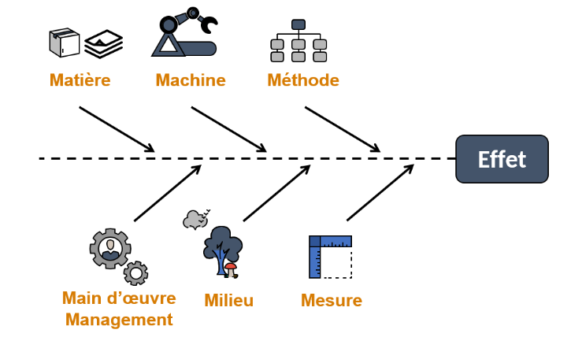
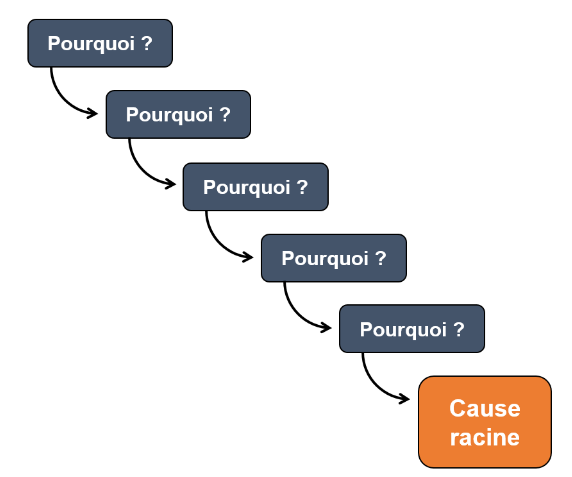
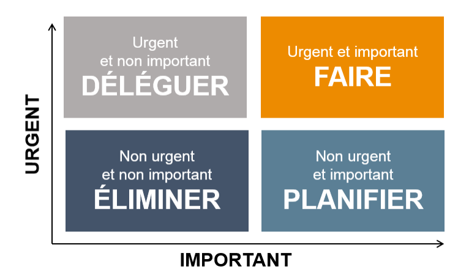

# Démarche de gestion des risques

> Adapté de "Démarche de gestion des risques" - MOOC GdP

## Définir efficacement les objectifs d'un projet

### Ne pas initier un projet irréaliste

Un projet irréalisable ne relève pas de la gestion des risques, il s'agit d'une erreur fatale ! Il faut donc faire une **étude de faisabilité** avant les projets.

### Valider les objectifs

Dans un premier temps il faut identifier les objectifs, pour cela on utilise les documents du projet : lettre de mission, cahier des charges, charte de projet. Cette étape vous permettra d’identifier
les points fondamentaux de blocage.

Pour visualiser et organiser les objectifs on utilise un matrice des objectifs. Elle est organisée de cette façon :

| Etat                | Livrable | Formation | Documentation | Valorisation |
| ------------------- | -------- | --------- | ------------- | ------------ |
| Insuffisant         |          |           |               |              |
| Réussite acceptable |          |           |               |              |
| Ok                  |          |           |               |              |
| Excellent           |          |           |               |              |

Dans les lignes on décrit l'intitulé de la colonne dans l'état correspondant.

## Identifier les menaces

Cette étude ne base pas sur les *objectifs* mais sur l'analyse des *menaces.*

### Ressources mobilisées par un projet

1. **L'humain** : Toute l’équipe du projet et vous. On pense en termes de force de travail (jour-homme), mais surtout en termes de compétences : un développeur java, un responsable administratif, une coordinatrice, etc.
2. **Ressources techniques** :  Entreprendre un projet mobilise des bureaux, des machines, les logiciels.
3. **Moyens financiers** : Ils vous permettent de recruter des ressources humaines, par exemple des prestataires ou d’acquérir les ressources techniques qui vous manquent, par exemple acheter un logiciel.
4. **Temps** : Un projet se déroule dans des délais imposés. Si vous manquez de temps, vous ne pouvez pas l’accomplir.

### Pour identifier les menaces

1. Exploiter les documents existants
	- Suffisamment de jalons ?
	- Chemin critique identifié ?
	- Matrice RACI ? (beaucoup de taches dépendent de la même personne)
2. Brainstorming
	- Identifier collectivement les menaces
3. Check-list
	- Norme ISO 31.000...
4. Retours d'expériences
	- Mémoire des projets précédents

## Prioriser les risques

### Le domaine de la gestion des risques

Chaque menace est évaluée selon 2 axes afin de la quantifier pour la transformer en risque. Ces deux axes sont :

1. La gravité, c’est-à-dire les conséquences si la menace se concrétise ;
2. La fréquence, c’est-à-dire la probabilité de cette menace.

Aux 4 extrêmes de notre repère, nous avons :

- Les risques de gravité : catastrophiques pour le projet, mais à fréquence extrêmement faible.
- Les risques de fréquence : s’ils ont peu de conséquences, ils se reproduisent très souvent.
- Les risques négligeables : à la fois rares et sans conséquences.
- Les risques intolérables, aux conséquences désastreuses et qui en plus ont de grandes chances de survenir.

Que relève de la gestion des risques ?

- Les risques de gravité ne se gèrent pas, il faut les assumer, vivre avec.
- Les risques de fréquence, ne se gèrent pas, ce sont des problèmes et il faut mettre en œuvre des démarches spécifiques pour les traiter : les outils et méthodes de résolution de problème.
- Les risques négligeables n’ont pas besoin d’être gérés. Ils peuvent être ignorés.
- Et enfin, les risques intolérables ne se gèrent pas non plus : il faut changer de projet ou revoir vos objectifs !

### Évaluer fréquence et gravité

Pour déterminer la **fréquence**, il y a deux grandes démarches :

1. La 1re et plus simple est d’attribuer un indice, par exemple entre 1 pour un événement rare et 4 s’il est très fréquent,
2. L’autre, la plus rigoureuse, est d’estimer la fréquence à partir de statistiques ou de données.

Pour déterminer la **gravité** la solution favorisée est l'équivalent monétaire : Le temps perdu, les produits jetés, tout peut trouver un équivalent financier :

- Le temps en salaires ;
- Les produits jetés se chiffrent avec leur coût de revient ;
- Une vente perdue avec le manque à gagner.

### Prioriser les risques : criticité

La criticité s'obtient en multipliant la fréquence par la gravité :
$\text{Criticité} = \text{Fréquence} \times \text{Gravité}$

Les risques prioritaires sont donc les plus critiques.

## Prévenir et analyser les risques d'un projet

### Gestion des risques : les stratégies

A partir de la matrice des risques deux approches apparaissent :

- la protection qui consiste à réduire la gravité d’un risque
- et l’évitement qui traite un risque en réduisant sa fréquence.

### Remonter aux causes racines

Il existe de nombreuses méthodes :

- **Diagrammes cause-effet**

- **Méthode des 5 pourquoi**

- **Arbre des causes**

#### Mesures classiques

- **Mesures organisationnelles** : la polyvalence : les membres de l’équipe peuvent se
remplacer en cas d’absence ou de démission
- **Juridiques** : dans le contrat imposer des pénalités à un fournisseur en retard
- **Financières** : en cas d’imprévu une réserve de 5% dans votre budget
- **Transférer le risque** : prendre une assurance : en cas d’incendie, vous serez remboursé

### Modèle de plan de prévention

Chaque ligne décrit un risque précis

- Il est estimé en gravité
- et en fréquence
- sa criticité est calculée
- à chaque risque prioritaire on attribue des mesures de prévention
- et un responsable du suivi
le tableau est trié pour mettre en haut les risques prioritaires

| Description | Gravité | Fréquence | Criticité | Responsable | Prévention |
| ----------- | ------- | --------- | --------- | ----------- | ---------- |
|             |         |           |           |             |            |

## Management, les bons comportements

### Gestion des risques

L'objectif de la gestion des risques est non pas de les gérer mais de les éviter. Pour faciliter leur gestion on utilise la matrice d'Ensenhower :

Eisenhower liste toutes les tâches à réaliser, et les classe en fonction de :

- leur importance
- et de leur urgence

Les 4 blocs correspondent aux 4 types de comportements à adopter :

- Pour les tâches qui sont à la fois urgentes et importantes. Celles-ci, vous devez les exécuter immédiatement, quitte à les prendre en charge vous-même.
- Celles qui sont importantes, mais non urgentes. Vous devez les planifier, les réaliser le mieux possible au bon moment. Le point critique ici, c’est de ne pas les oublier et d’être proactif. Mettez un rappel sur votre agenda par exemple.
- Celles qui sont urgentes, mais pas importantes. Le chef de projet ne doit pas s’en occuper lui-même, mais les déléguer. Par exemple les transférer à une personne de confiance avec une feuille de route : un PDCA, par exemple.
- Enfin, les tâches qui ne sont ni urgentes ni importantes. Ne perdez pas votre temps avec elles !

### Locus de contrôle

> Manière dont les personnes analysent leurs succès et leurs échecs

En gestion de risque il faut être proactif, le locus de contrôle doit être interne : Il faut se sentir responsable de tout et donc chercher tous les moyens possibles pour anticiper et placer d’avance sous contrôle tous les problèmes.

### La loi de Brooks : gérer les retards

Une autre erreur majeure quand un problème survient dans votre projet est
décrite par la loi de Brooks :
> Ajouter des participants à une tâche en retard la retarde encore plus

Pourquoi ?

Si vous recrutez, cela va prendre du temps de former les nouveaux membres de
l’équipe, et plus vous serez nombreux, plus la coordination demandera du temps.

La solution est donc de *travailler plus*.

## Assurer un suivi des risques

### Affiner le plan de gestion des risques

Pour améliorer votre surveillance des risques les plus importants, vous pouvez
ajouter à votre plan deux colonnes :

- En cas de problème, préparez à l’avance le plan B dans une cellule “Réparation” ;
- En plus du responsable du suivi de chaque risque, insistez sur la détection et anticipez le déclenchement d’une menace : c’est la colonne “Veille / Détection”.

### Faire des mises à jour régulières

Non seulement vous devez opérer la surveillance et le suivi continuel de vos risques, mais votre projet évolue continuellement et votre plan initial devient vite obsolète.

Pour garder la pertinence de votre gestion des risques il faut faire le point et remettre à jour le plan à chaque étape majeure d’un projet, avant toute réunion. Le suivi des risques est un cycle : planifier, évaluer, gérer et vérifier.

### Les plans défaillants

L’expérience montre, hélas de nombreux plans de gestion des risques défaillants : ceux qui sont périmés, peu crédibles ou dans lesquels le coût de la prévention est supérieur à celui du risque traité.

### Ce qu'il faut éviter

- Travailler sur des risques flous et mal identifiés
- Mélanger des risques différents
- Travailler dans son coin.
- Mal prioriser les risques.
- Ne pas saisir les opportunités, on parle aujourd'hui de *risk & opportunities manager.*

### Principe de Pareto

> 20 % des causes sont responsables de 80 % des conséquences

Donc 80 % de la criticité se trouve concentrés dans les toutes premières lignes de votre plan.
