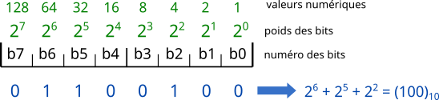

# Représentation des nombres

## Entiers relatifs

### Représentation d'un nombre entier

Un octet est composé de 8 bits (bit provient de la contraction en anglais de binary digit), chaque bit peut avoir la valeur 0 ou 1.

Le codage d'un nombre entier se fait donc en base 2 (puisqu'un bit peut avoir 2 valeurs différentes), comme le montre le schéma suivant :

>Schéma ci dessus provenant de dkryton.fr

### Entiers relatifs : Codage complément à deux

**Un entier relatif** est représenté en binaire comme un entier naturel à la différence que le premier bit (appelé _bit de poids fort_) représente le signe ($0$ si positif, $1$ si négatif).  
On code les nombres négatifs en _complément à deux_ :

1. Méthode 1 :
   - prendre son opposé
   - le représenter en base 2 sur n-1 bits
   - complémenter sur chaque bit (remplacer les 0 par des 1 et vice-versa)
   - ajouter 1 au nombre obtenu
   - mettre le bit de poids fort à 1 (le premier, pour signifier qu'il s'agit d'un entier négatif)
2. Méthode 2 :
   - pour coder sur $n$ bits un entier relatif négatif en complément à deux, on code son opposé auquel on ajoute $2^n$.

## Codage des réels

### Codage de la partie décimale

L'expression de la partie dans une nouvelle base $B$ est obtenue par multiplication successive par $B$ de la partie décimale du résultat précédent, l'unité obtenue correspond à un élément de la décomposition. On procède ainsi de suite jusqu'à ce qu'il n'y ait plus de partie décimale ou que le nombre de bits obtenus correspond au nombre de bits dont on dispose.

**_Exemple :_** passage de 0,145 en base 2
0,145 $\times$ 2 = 0,29  
0,29 $\times$ 2 = 0,58  
0,58 $\times$ 2 = 1,16  
0,16 $\times$ 2 = 0,32  
0,32 $\times$ 2 = 0,64  
0,64 $\times$ 2 = 1,28  
...  
donc 0,145 $\approx$ (0,001001)2

**_Autre méthode_**

- Imposer le nombre $n$ de chiffre significatif souhaité
- Multiplier la partie décimal par $B^n$, puis coder le résultat de la partie entière.

### Codage d'un réel - simple précision

On code les nombres sur 32 bits avec trois composantes :

- le **_signe_** codé sur un seul bit, le bit de poids fort, 0 si positif ou 1 si négatif
- l'**_exposant_** codé sur les 8 bits suivants
- la **_mantisse_** (dite _réduite_ car seuls les bits situés après la virgule sont retenus) sur les 23 bits restants

| 1 bit | 8 bits   | 23 bits          |
| ----- | -------- | ---------------- |
| signe | exposant | mantisse réduite |

#### Méthode

- On code le nombre en binaire
- On décale $n$ fois la virgule jusqu'à on ait un 1 suivi du reste du nombre, ce qui reste après est la _mantisse_.
  Par example :
  1000 devient 1,000 ; 0,100 devient 1,00
- Le décalage est noté $2^n$, on ajoute au décalage $2^{a-1}-1$ avec $a$ le nombre de bits sur lequel on code l'exposant afin de coder des décalages positifs **et** négatifs.
- Les exposants 0000 0000 et 1111 1111 sont interdits, le second (1111 1111) peut signaler des erreurs, on parle alors de NaN (Not a Number).

#### Décodage

La formule des nombres réels est $(-1)^S \times 2^{E - 127} \times (1 + M)$. Avec :

- S le bit de signe
- E l'exposant auquel on doit soustraire 127 (ou $2^{a-1}-1$) pour obtenir l'exposant réel
- M est la mantisse

### Double précision

| 1 bit | 11 bits  | 52 bits          |
| ----- | -------- | ---------------- |
| signe | exposant | mantisse réduite |

---

### Opérations

- Pour une addition / soustraction :
  - effectuer l'opération sur les mantisses en pensant à décaler les représentations du nombre nécessaire de bits pour prendre en compte les exposants différents
  - modifier le résultat pour mettre sous la bonne forme

---

## Compléments

### Représentation plus concise d'un nombre entier - Le code hexadécimal

Le code _hexadécimal_ de base 16 utilise 16 éléments: 0, 1, 3, 4, 5, 6, 7, 8, 9, A, B, C, D, F. On le signale par un "0x" devant le nombre.  
Le passage se fait selon cette méthode :

- regrouper le binaire en paquet de 4
- faire correspondre les paquets de 4 à un élément de la base 16

Tableau de conversion :

| Binaire | Hexadécimal | Binaire | Hexadécimal |
| ------- | ----------- | ------- | ----------- |
| 0000    | 0           | 1010    | A           |
| 0001    | 1           | 1011    | B           |
| 0010    | 2           | 1100    | C           |
| 0011    | 3           | 1101    | D           |
| 0100    | 4           | 1110    | E           |
| 0101    | 5           | 1111    | F           |
| 0110    | 6           |         |             |
| 0111    | 7           |         |             |
| 1000    | 8           |         |             |
| 1001    | 9           |         |             |

#### Dépassement de capacité - Overflow

Si l'addition de deux nombre en binaire utilise plus de bits que le nombre sur lequel on les code, le résultat va "dépasser" vers a gauche, on parle alors de dépassement.  
Pour certain systèmes, le calcul ne crée pas d'erreur tandis que sur d'autres une erreur est signalé.

### Notion de mode d'arrondi et problème de précision

Le codage des réels nécessite l'utilisation d'arrondis, en effet tous les réels ne sont pas codé sur $n$ bits, l'espace entre les réels représentables ne sont pas égaux.

Soit $F$ l'ensemble des nombres flottants représentables
Alors pour $x \in F$, deux cas peuvent se présenter :

- si $x = X \in F$ alors le codage est exact et égal à $X$.
- sinon ils existents $X^{-} \in F$ et $X^{+} \in F$ tels que
  $X^{-} < x < X^{+}$ et $]X^{-},X^{+}[ \cap F=\emptyset$

Un exemple marquant est $0.1 + 0,2 = 0,300000004$, vous pouvez en apprendre plus sur ce [site](https://0.30000000000000004.com/).

### Représentation d'autres informations

#### Caractères

Il existe plusieurs codages :

- ASCII (1961) qui définit 128 caractères et est codé sur 7 bits
- ISO 8859 (1986) qui définit 15 jeux de 256 caractères codé sur 1 octet : extensions du code ASCII pour prendre en compte les caractères spéciaux des différentes langues
- Unicode (1991) et UTF-8 (1993) définissent environ 245 000 caractères mais peuvent en contenir plus d'un million

#### Images (matricielles)

Les images sont stockées et affichées sous forme d'un tableau (d'où le nom image matricielle) de pixels ("picture elements") colorés. On parle aussi de carte de point ("bitmap").

Selon les images, le codage peut être réalisé en :

- noir et blanc: 1 bit/px
- niveau de gris: 4, 8 ou 16 bit/px
- couleur RGB (Red, Green, Blue): chaque couleur est décomposée en sa composante rouge, verte et bleue et chaque composante est codée sur 4, 8 ou 16 bits (le plus souvent sur 8 bits selon le modèle rgb($r,g,b$) avec $r$, $g$ et $b$ $\in [0;255]$)
