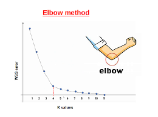
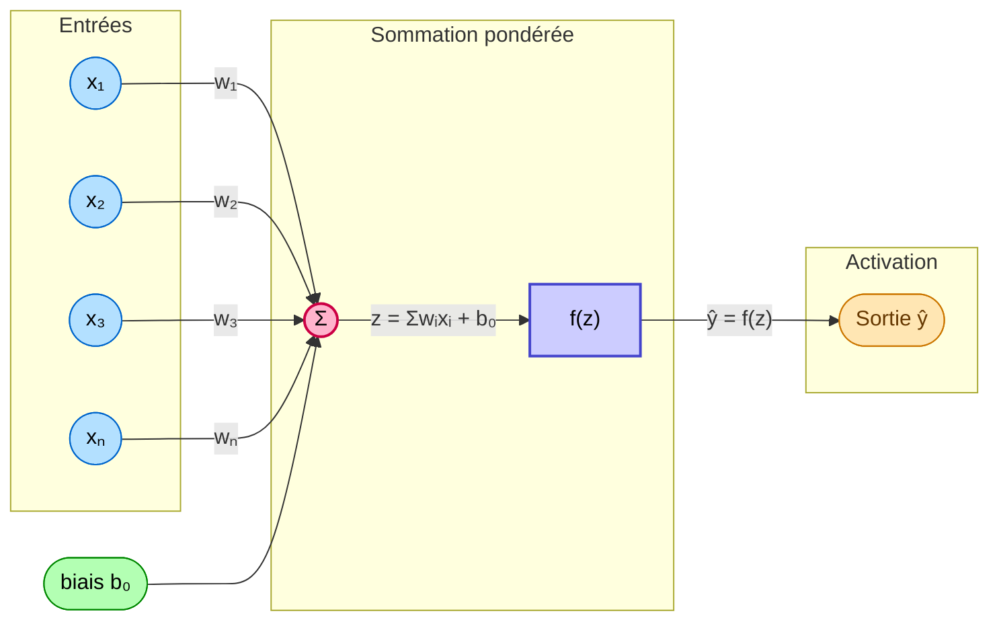
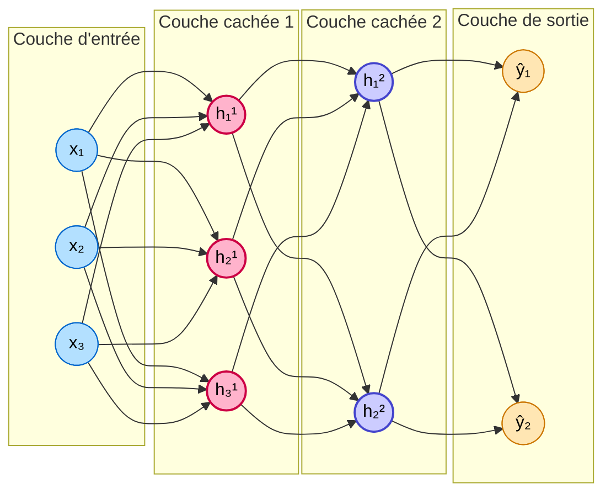

# IA

> Artificial intelligence or An Indian [^1] ? That's the question.

## Introduction

### Principe

Le therme d'IA désigne des méthodes qui permettent d'effectuer des prises de décisions (ou des **prédictions**) à partir de la reproduction d'un comportement observé dans un ensemble de données[^2]. On distinguera plusieurs grandes étapes :

1. constitution d'une **base de données d'apprentissage**  
1. phase d'apprentissage où l'on entraîne une **fonction de prédiction** (où l'on crée la fameuse IA)
1. phase d'exploitation du modèle où l'on réalise des prédictions (ou des **inférences**)

### Typologie des problèmes d'apprentissage

On divise généralement les problèmes d'apprentissage en trois catégories :

1. **Apprentissage supervisé** : on connaît le lien entre les données, l'algorithme cherche à l'apprendre. Exemples : [k-NN](#knn), [régression](#regression), [réseaux de neurones](#reseaux-de-neurones).
1. **Apprentissage non supervisé** : on ne connaît pas le lien entre les données, l'algorithme cherche à le découvrir. Exemple : [k-means](#k-means).
1. **Apprentissage par renforcement** : pas de données étiquetées; un agent apprend une politique en interagissant avec un environnement et en recevant des **récompenses** (positives/négatives).

#### Concernant les données d'entrée

On divise la base de données d'apprentissage[^3] en trois parties : **entraînement**, **validation** et **test**. On détaillera plus tard la différence entre les deux dernières (pertinente pour les réseaux de neurones).

L'étape de modélisation consiste à choisir une représentation pertinente des données, elle est généralement suivie d'une étape de **normalisation** qui consiste à ramener les données à une échelle commune pour éviter que certaines soient prédominantes. On peut par exemple les ramener entre 0 et 1.  
L'intérêt de cette étape est de s'assurer que les données soient comparables, par exemple lors d'un calcul de distance dans la méthode [k-means](#k-means).

Pour représenter les données on utilisera des vecteurs $X_i$ (ensemble des **features** de la i-ème entité) associés à des labels $y_i$ (ou des classes). Leurs dimensions sont indépendantes.

### Mesures de performance

On cherche à mesurer la performance d'un algorithme, pour cela on mesure la qualité des prédictions à partie de la base de données d'apprentissage. La forme de cette mesure dépend du type de problème que l'on cherche à résoudre.

#### En classification binaire

Lorsque les sorties prennent des valeurs discrètes, on utilise la **justesse** (ou **accuracy**)[^4] : il s'agit de la proportion de prédictions correctes sur l'ensemble des prédictions.  
$\text{justesse} = \frac{1}{N} \sum_{i=1}^N \mathbb{1}_{\hat{y}_i = y_i}$
où $\hat{y}_i$ est la prédiction de l'algorithme et $y_i$ la valeur réelle.

#### En régression

Lorsque les sorties prennent des valeurs continues, on utilise l'**erreur moyenne quadratique** (ou **mean squared error**) : il s'agit de la moyenne des carrés des erreurs entre la valeur réelle et la valeur prédite.

$$ \text{MSE} = \frac{1}{N} \sum_{i=1}^N (y_i - \hat{y}_i)^2 $$

**Il s'agit de cette fonction que l'on cherche à minimiser lors de l'apprentissage.**

#### Classification multi-classes

Face à un problème à $k$ classes, on utilise une **matrice de confusion** qui permet de visualiser les erreurs de classification.  

<table>
  <tr>
    <th></th>
    <th style="background-color:#a8d5a2; color:#000;">Predicted A</th>
    <th style="background-color:#f5a6a6; color:#000;">Predicted B</th>
    <th style="background-color:#ffe599; color:#000;">Predicted C</th>
  </tr>
  <tr>
    <th style="background-color:#a8d5a2; color:#000;">Actual A</th>
    <td style="background-color:#8bc98b; color:#000;">50</td>
    <td style="background-color:#f4bcbc; color:#000;">2</td>
    <td style="background-color:#ffe8a1; color:#000;">3</td>
  </tr>
  <tr>
    <th style="background-color:#f5a6a6; color:#000;">Actual B</th>
    <td style="background-color:#f4bcbc; color:#000;">4</td>
    <td style="background-color:#8bc98b; color:#000;">45</td>
    <td style="background-color:#ffe8a1; color:#000;">6</td>
  </tr>
  <tr>
    <th style="background-color:#ffe599; color:#000;">Actual C</th>
    <td style="background-color:#f4bcbc; color:#000;">1</td>
    <td style="background-color:#f4bcbc; color:#000;">5</td>
    <td style="background-color:#8bc98b; color:#000;">40</td>
  </tr>
</table>

Les termes sur la diagonale représentent les bonnes classifications, les autres termes représentent les erreurs de classification. On peut également observer si une classe est sur-représentée ou sous-représentée.

### En bref

1. Base de données d'apprentissage séparée en trois parties : entraînement, validation et test
1. Entrainement/apprentissage :
    - Choix d'une fonction de coût
    - Minimisation de la fonction de coût sur la base d'apprentissage
    - Validation de la fonction de coût sur la base de validation
1. Inférence : utilisation

## Régression

### Régression linéaire

La régression linéaire est un algorithme d'apprentissage supervisé qui cherche à établir une relation entre les variables d'entrée et de sortie. Il s'agit d'un modèle paramétrique qui cherche à minimiser la somme des carrés des erreurs entre les valeurs prédites et les valeurs réelles.

#### Fonction coût et descente de gradient

On utilise l'**erreur quadratique moyenne** (ou **mean squared error**) comme fonction coût :

$$ \text{MSE} = \frac{1}{N} \sum_{i=1}^N (y_i - f(x_i))^2 $$

On utilisera donc le minimum de cette fonction; dans le cas d'une régression « simple » (une droite par exemple) il existe une solution **analytique**, la **méthode des moindres carrés**.  
Pour des problèmes plus complexes, il n'existe pas toujours de solution analytique; on utilisera alors la **descente de gradient**. Il s'agit d'une méthode itérative qui consiste à calculer le gradient de la fonction coût par rapport aux paramètres du modèle et à les mettre à jour dans la direction opposée au gradient.  

$$ \theta_{t+1} = \theta_t - \alpha \nabla J(\theta_t), \alpha \in \mathbb{R}_{+}^{*} $$

où $\alpha$ est le **taux d'apprentissage** (ou **learning rate**) qui permet de contrôler la vitesse de convergence de l'algorithme. Il s'agit d'un paramètre important à régler : trop petit, il faudra beaucoup d'itérations pour converger; trop grand, il y a un risque de divergence.

Cette méthode peut s'illustrer ainsi :  
<figure markdown="1">
  
</figure>

On descend le long du gradient jusqu'à atteindre un minimum (comme si on descendait dans une cuve).

### Régression logistique

La régression logistique est une technique statistique pour modéliser la probabilité d'un événement binaire. Elle modélise **la probabilité d'appartenance à une classe** en utilisant la fonction logistique (ou sigmoïde) :

$$ P(y=1|x) = \frac{1}{1 + e^{-(\beta_0 + \beta_1 x)}} $$

Avec ici deux paramètres (cas particulier).

## KNN et K-means

### KNN

Le K plus proches voisins (ou **KNN**) est un algorithme d'apprentissage supervisé qui cherche à classer un point en fonction de ses voisins les plus proches. Il s'agit d'un algorithme de classification dit de **lazy-learning** car il ne présente pas de phase d'apprentissage.

L'algorithme procède en trois grandes étapes :

- calculer la distance entre le point à classer et tous les points de la base d'apprentissage
- trier les distances et sélectionner les $k$ plus proches voisins
- prédire la classe du point à classer en fonction des classes des $k$ plus proches voisins (majorité simple ou pondérée par la distance)

Pour évaluer la pertinence des prédictions, on utilise une matrice de confusion qui permet de visualiser les erreurs de classification.

### K-means

L'algorithme K-means est un algorithme d'apprentissage non supervisé qui cherche à regrouper les données en $k$ clusters. Il s'agit d'un algorithme itératif où les similitudes entre les données apparaissent comme des nuages de points : ce sont les **clusters**.

On construit ces $k$ clusters (on a imposé $k$) par l'association de chaque point à son centre de gravité (ou **centroïde**).

L'algorithme débute avec des centroïdes aléatoires, puis il procède en deux étapes :

1. **Attribution** : chaque point est associé au centroïde le plus proche (on utilise la distance euclidienne)
1. **Mise à jour** : on calcule le nouveau centroïde de chaque cluster en prenant la moyenne des points qui lui sont associés

On répète ces deux étapes jusqu'à ce que les centroïdes ne changent plus (ou que la variation soit jugée suffisamment faible) ou que le nombre maximal d'itérations soit atteint.  
Pour déterminer le nombre de clusters, on utilise la méthode du coude qui consiste à tracer la somme des carrés des distances entre les points et leurs centroïdes en fonction du nombre de clusters. On cherche le point où la courbe commence à se stabiliser (le coude).

<figure markdown="1">
  
</figure>

## Réseaux de neurones

### Perceptron

Le neurone artificiel ou **neurone formel** (ou encore *perceptron*) est l'unité élémentaire de traitement d'un réseau neuronal.  

#### Fonctionnement mathématique

1. **Entrées pondérées**: Chaque entrée $x_i$ est multipliée par son poids associé $w_i$
2. **Sommation**: Les produits sont additionnés avec le biais $b_0$: $z = \sum_{i=1}^{n} w_i x_i + b_0$
3. **Activation**: La somme est passée à travers la fonction d'activation: $\hat{y} = f(z)$

La fonction d'activation $f$ peut prendre différentes formes (sigmoïde, ReLU, tanh, etc.) selon l'application visée. Ces fonctions **ne sont pas linéaires**.

4. La relation entre les entrées et la sortie est appelée **équation de propagation**.

### Apprentissage et limites

Lors d'une utilisation d'un neurone comme *classifieur* le neurone n'est capable que de séparer des **données linéairement séparables**. Par exemple, il ne pourra pas séparer des données en forme de cercle.  
On utilise alors des réseaux de neurones qui sont des ensembles de neurones organisés en couches.

### Réseau de neurones - Perceptron multicouche

Un réseau de neurones est constitué de plusieurs couches de neurones interconnectés. Cette interconnexion se fait entre couches successives :

- une **couche d'entrée** qui réalise une simple copie  
    - des couches intermédiaires (ou **couches cachées**)  
        - qui ont des nombres de neurones différents mais  
        - qui ont **la même fonction d'activation**  
    - une **couche de sortie**

### Apprentissage

On cherche à minimiser la fonction coût sur l'ensemble des données d'apprentissage, qu'on peut choisir comme étant la **MSE**.  

Minimiser la fonction coût revient à optimiser les poids du réseau de neurones. On utilise la **rétropropagation** (ou **backpropagation**) qui consiste à calculer le gradient de la fonction coût par rapport aux poids du réseau et à les mettre à jour en suivant la direction opposée du gradient.  

On peut effectuer ce calcul sur un groupe de données appelé **batch** afin de limiter le temps/coût de calcul.

#### Critère d'arrêt - Risque de sur-apprentissage

A force d'itérations, le réseau de neurones peut apprendre à mémoriser les données d'apprentissage au lieu d'apprendre à généraliser. On parle de **sur-apprentissage** (ou **overfitting**). Pour éviter cela, on utilise un ensemble de validation qui permet de vérifier la performance du modèle sur des données non vues. On arrête l'apprentissage lorsque la performance sur l'ensemble de validation commence à diminuer.

## Comparaison des méthodes

|                         | Modèle linéaire (régression ou classification) | k plus proches voisins | Réseaux de neurones (éventuellement profonds) |
|-------------------------|-------------------------------------------------|-------------------------|----------------------------------------------|
| **Temps de calcul à l'apprentissage** | + Inversion de matrice et calcul de $X^T X$ $\mathcal{O}(d^3 + nd^2)$ mais existence de méthodes numériques plus efficaces | ++ Stockage des données de la base de donnée d'entraînement | -- Procédure longue et coûteuse notamment sur de grandes bases de données |
| **Temps de calcul à la prédiction** | ++ 1 Produit matrice vecteur $\mathcal{O}(d \times p)$ | - Tri d'un tableau de distances $\mathcal{O}(n \log(n))$ | + Séquence de produits matrice vecteur |
| **Performances avec peu de données d'entraînement** | ++ Peu de paramètres à apprendre → bonnes performances avec peu de données | + Performances correctes avec peu de voisins | -- Peu de paramètres par couche conduisent à un modèle proche du linéaire |
| **Performances avec données abondantes** | - Peu de paramètres apprenables | + Réglage du nombre de voisins | ++ Grande flexibilité de la fonction de prédiction |
| **Performances avec données complexes (image / texte)** | - Représentation des entrées difficile à adapter efficacement | - Difficile de choisir une distance correcte | ++ Possibilité d'adapter les couches cachées aux propriétés des entrées |

[^1]: Ceci est une vraie question [et Microsoft c'est fait avoir](https://www.clubic.com/actualite-567732-cette-startup-a-berne-microsoft-avec-700-indiens-deguises-en-ia.html).
[^2]: Bien évidemment acquises en toute légalité comme [Nvidia](https://www.404media.co/nvidia-ai-scraping-foundational-model-cosmos-project/), [Meta](https://www.wired.com/story/new-documents-unredacted-meta-copyright-ai-lawsuit/)
[^3]: Toujours acquise dans le respect des droits d'auteurs, n'[est](https://www.nytimes.com/2023/12/27/business/media/new-york-times-open-ai-microsoft-lawsuit.html)-[ce](https://torrentfreak.com/authors-openais-fair-use-argument-in-copyright-dispute-is-misplaced-230928/) [pas](https://torrentfreak.com/authors-sue-nvidia-for-training-ai-on-pirated-books-240311/) ?
[^4]: A ne pas confondre avec la précision (ou **precision**) qui permet de mesurer la proportion de faux positifs dans les prédictions.
